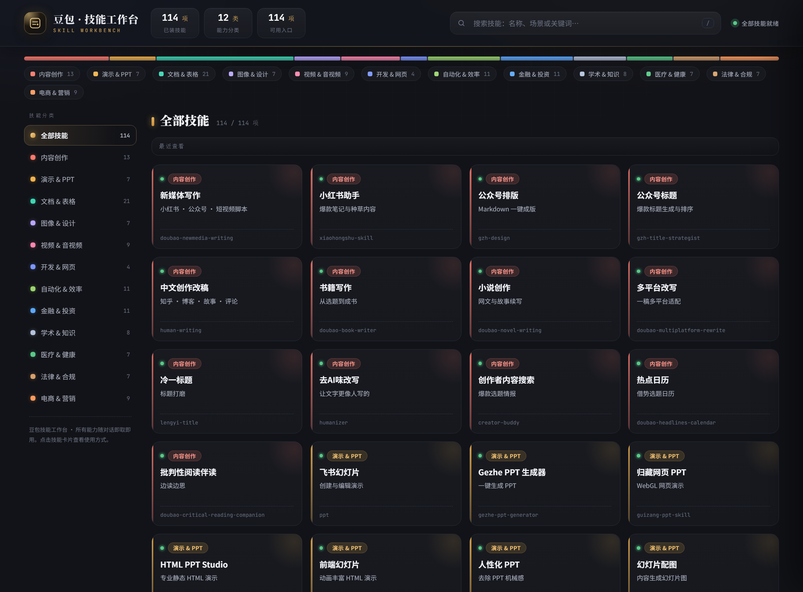
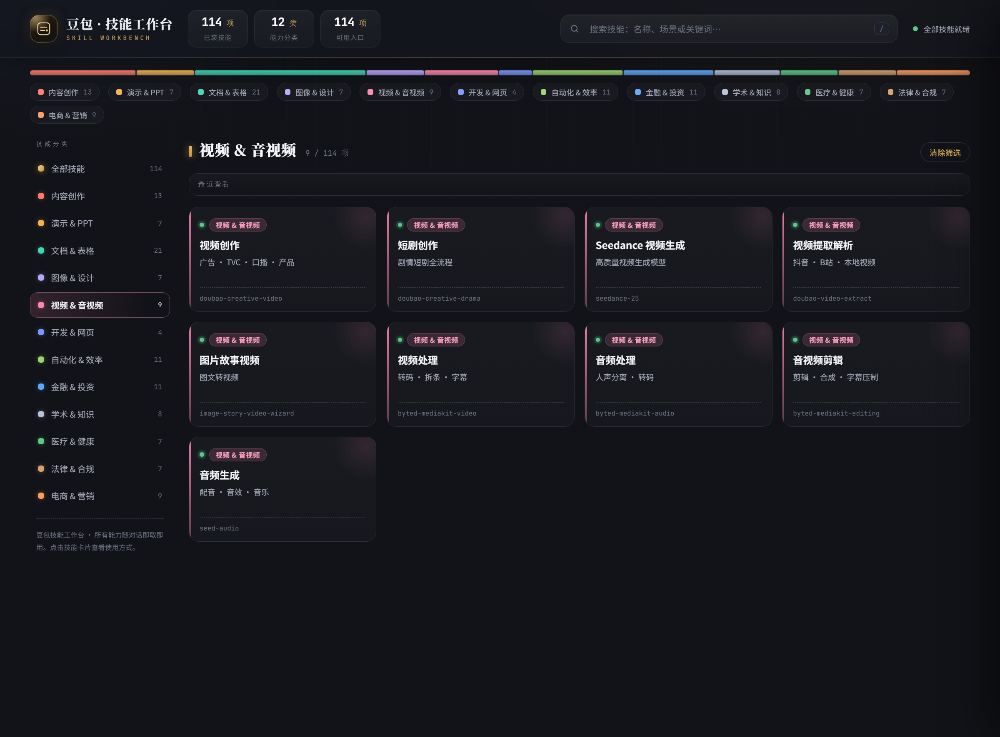
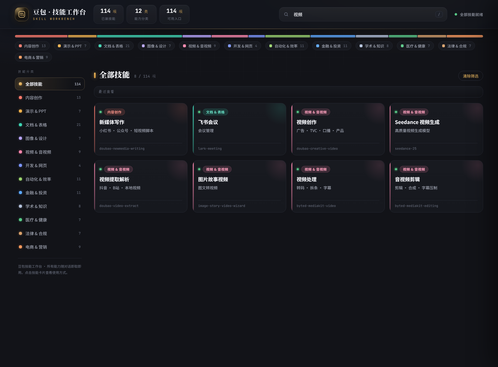
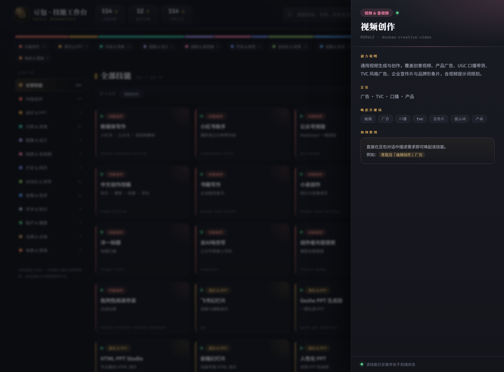

# 豆包 · 技能工作台（Doubao Skill Workbench）

> 一个把豆包工作区**全部 Skill 技能**可视化、可分类筛选、可关键词检索的可交互工作台。
> **单文件 HTML、零依赖、零构建、离线可用**——打开即用。



## 这是什么

豆包工作区里安装了上百项技能，散落在各个对话与目录中，很难一眼看清「我到底有哪些能力、各自怎么唤起」。本工作台把它们整理成一块**深色控制台风格的技能驾驶舱**：顶部统计与全局搜索、12 分类分布条、左侧分类导航、技能卡片网格，以及点击卡片后滑出的详情抽屉。

当前收录 **114 项技能、12 大分类**。

## 特性

- **一屏总览**：技能总数、分类数统计，以及按分类占比着色的分布条与图例。
- **全局搜索**：同时匹配技能名称、定位、能力说明、模块名与唤起关键词；按 `/` 一键聚焦搜索框。
- **三种筛选**：顶部分布条、分类图例、左侧导航都可切换分类，并可一键清除筛选。
- **详情抽屉**：点击任意卡片，右侧滑出能力说明、定位、唤起关键词与「如何使用」示例。
- **最近查看**：自动记录最近浏览的技能（保存在浏览器 localStorage，不上传任何数据）。
- **键盘可达**：卡片支持 Tab 聚焦与回车打开，`Esc` 关闭抽屉。
- **纯前端单文件**：原生 HTML / CSS / JavaScript，无框架、无构建步骤、无外部数据请求，双击 `index.html` 即可运行。

## 界面预览

### 分类筛选
点击左侧导航或顶部图例即可只看某一分类，下图为「视频 & 音视频」分类。



### 全局搜索
输入关键词后跨分类实时匹配，并显示命中数量。



### 技能详情抽屉
点击卡片查看该项技能的完整说明与唤起方式。



## 本地使用

直接下载并用浏览器打开 `index.html` 即可，无需安装任何环境：

```bash
git clone https://github.com/chenshuai527/doubao-skill-workbench.git
cd doubao-skill-workbench
# 用任意现代浏览器打开 index.html
```

## 在线访问（GitHub Pages）

在仓库中依次打开 **Settings → Pages → Build and deployment → Source**，选择分支 `main`、目录 `/ (root)` 后保存，稍等一两分钟即可通过下面的网址直接访问：

```
https://chenshuai527.github.io/doubao-skill-workbench/
```

## 目录结构

```
doubao-skill-workbench/
├── index.html        # 工作台本体（单文件，含全部技能数据与交互逻辑）
├── screenshots/      # 界面介绍截图
│   ├── 01-overview.png
│   ├── 02-category-video.png
│   ├── 03-search.png
│   └── 04-detail-drawer.png
└── README.md
```

## 技能分类一览

| 分类 | 数量 | 覆盖能力（示例） |
| --- | --- | --- |
| 内容创作 | 13 | 新媒体写作、小红书、公众号排版、小说创作、去 AI 味改写 |
| 演示 & PPT | 7 | 飞书幻灯片、网页 PPT、幻灯片配图 |
| 文档 & 表格 | 21 | 飞书文档 / 多维表格 / 日历 / 任务 / 云盘 / 知识库、Excel 全场景 |
| 图像 & 设计 | 7 | 创意设计、文生图、电商主图 / 详情图 |
| 视频 & 音视频 | 9 | 视频创作、短剧、文生视频、视频提取、音视频剪辑 |
| 开发 & 网页 | 4 | 网页应用构建、GitHub 远程、PDF、技能创作器 |
| 自动化 & 效率 | 11 | 浏览器 / 桌面自动化、定时任务、企业微信、舆情监控 |
| 金融 & 投资 | 11 | 个股日报、智能选股、财报归因、公告解读、财务建模 |
| 学术 & 知识 | 8 | 学术调研、论文写作润色、评审、引用核验 |
| 医疗 & 健康 | 7 | 报告解读、循证临床辅助、医学文献检索 / 翻译 |
| 法律 & 合规 | 7 | 合同审查 / 起草、合规评估、隐私审计 |
| 电商 & 营销 | 9 | 选品、营销方案、Listing 本地化、巨量引擎投放 |

## 技术说明

- 纯原生实现，不依赖任何运行时或后端服务。
- 技能数据以内置数组形式维护，新增 / 修改技能只需编辑 `index.html` 中的 `DATA`。
- 界面字体通过自托管字体服务加载，无字体时自动回退到系统字体，不影响使用。

## License

MIT
